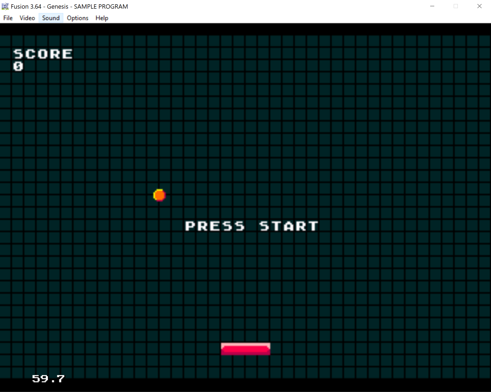

# MegaPong
Pong Game for Megadrive/Genesis a playable ROM is included in the out directory (rom.bin)
This needs an emulator (I use Fusion) to run or can be written to a Cartridge, if you're feeling adventurous 

To compile you'll need to have SGDK installed with environment variables setup. You can get SGDK
here: <a href="https://github.com/Stephane-D/SGDK">Stephane-D SGDK</a>

